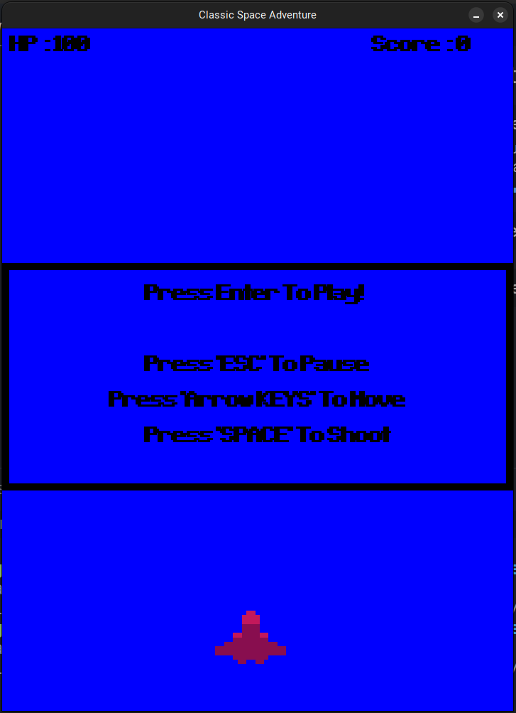
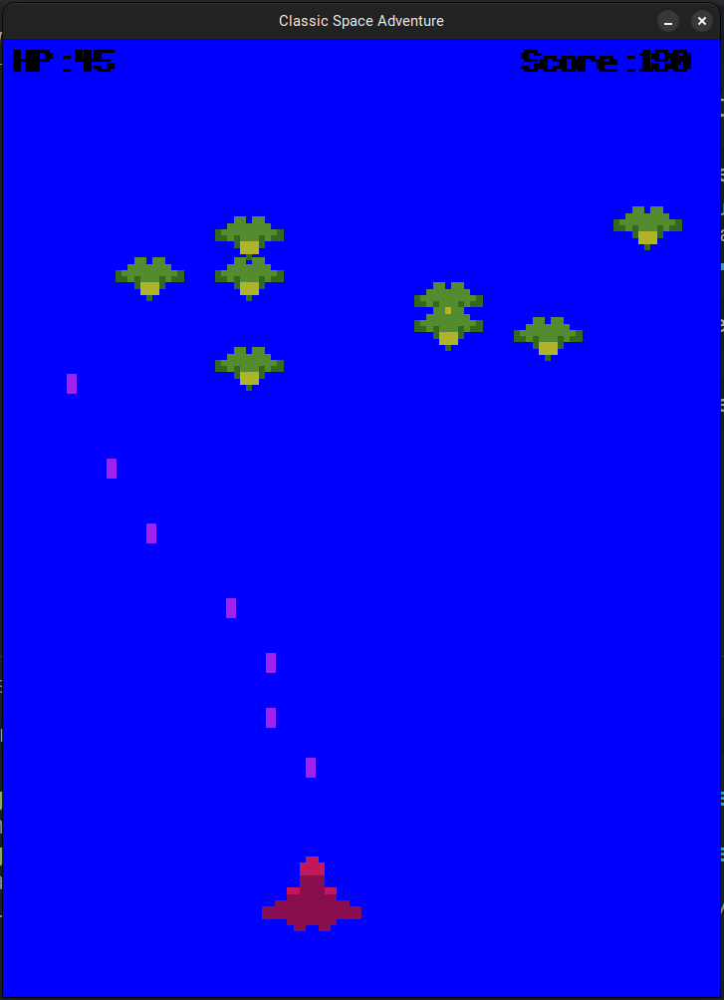

# Classic Space Adventure - Pygame Game

## Overview

"Classic Space Adventure" is a beginner-friendly 2D space shooter game developed using Pygame. The game places the player in control of a spaceship, tasked with navigating through space, shooting enemies, and avoiding collisions. The project was created as a resource for the GD4B (Game Development for Beginners) workshop organized by the UIU App Forum.

    
    

## Workshop Goal

The primary goal of the GD4B workshop is to provide participants with fundamental knowledge about game development concepts using Pygame and Python. The workshop focuses on:

- Understanding the Game Loop: Participants will learn about the game loop, a fundamental structure in game development that handles continuous game execution.

- Collision System: A brief introduction to collision systems will be provided, emphasizing the importance of efficient collision detection in games.

- Computer Graphics: Participants will gain insights into basic computer graphics principles, particularly in the context of a 2D game.

- Rendering Layer: An overview of rendering layers will be presented, demonstrating how different elements are drawn on the screen.

- Object-Oriented Programming (OOP) Approach with Pygame and Python: The workshop introduces the benefits of an OOP approach for organizing and managing game entities efficiently.

## Features/Functions

### 1. Player Ship
- Move left and right using arrow keys.
- Shoot lasers with the spacebar.

### 2. Enemies
- Descend from the top of the screen.
- Automatically move downward.

### 3. Scoring and Health System
- Earn points for destroying enemies.
- Player health decreases upon collisions with enemies.

### 4. Sound and Graphics
- Utilizes Pygame for sound effects and image rendering.
- Sound effects enhance the gaming experience.
- Graphics include player ship, enemies, and lasers.

## Implemented Systems

### 1. 2D Grid System
- Facilitates player movement and positioning in a quantized grid, providing simplicity in calculations.

### 2. Rectangle Collision System
- Implements bounding box collision for efficient detection between game entities.

### 3. Game Loop
- Manages continuous execution, updating game state, and rendering graphics.

## Pygame APIs Used

### 1. `pygame.Rect`
- Defines rectangular areas for efficient collision detection.

### 2. `pygame.math.Vector2`
- Handles 2D coordinates for simplified movement and positioning.

### 3. `pygame.image`
- Loads and scales images for game entities, enhancing visual appeal.

### 4. `pygame.mixer.Sound`
- Plays sound effects, contributing to the overall gaming experience.

### 5. `pygame.display`
- Creates and manages the game window for rendering graphics.

### 6. `pygame.event`
- Handles user input events, such as key presses.

### 7. `pygame.font`
- Renders text on the screen, displaying health and score information.

## GD4B Workshop

The GD4B workshop, named after "Game Development for Beginners," is organized by the UIU App Forum. The workshop aims to provide a hands-on introduction to game development concepts using Pygame and Python. Participants will gain practical knowledge about essential aspects of game development, from understanding the game loop to implementing collision systems and adopting an OOP approach.

## Credits

    Game developed by Md. Fatin Shadab
    Workshop organized by UIU App Forum - GD4B Workshop
    
Feel free to explore "Classic Space Adventure" to enhance your understanding of game development concepts in a beginner-friendly environment. Enjoy the game and happy coding! 🚀🎮

## [GD4B Bangla Resource on GameLoop and pygame](https://github.com/FatinShadab/SnakeGame)
